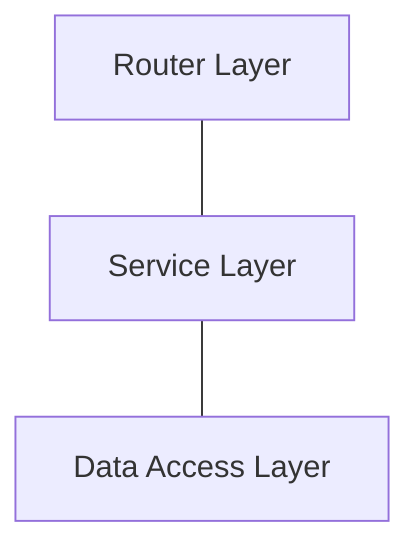

# Progetto

## Obiettivo

L'obiettivo del progetto è quello di realizzare un API 

## Progettazione

### Architettura

Nel realizzare il progetto si è deciso di seguire come pattern architetturale quello delle **Layered Architecture**. In questa architettura gli strati che la costituiscono hanno ognuno un compito specifico e una responsabilità specifica, quelli che andremo ad implementare sono:

- **Router Layer**
- **Service Layer**
- **Data Access Layer**

### Docker
