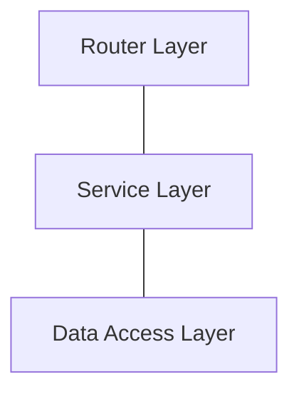
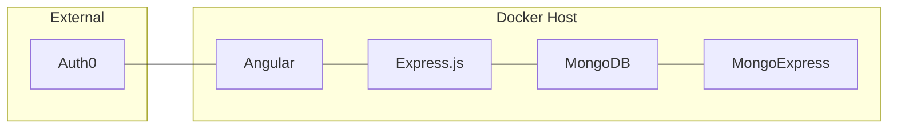
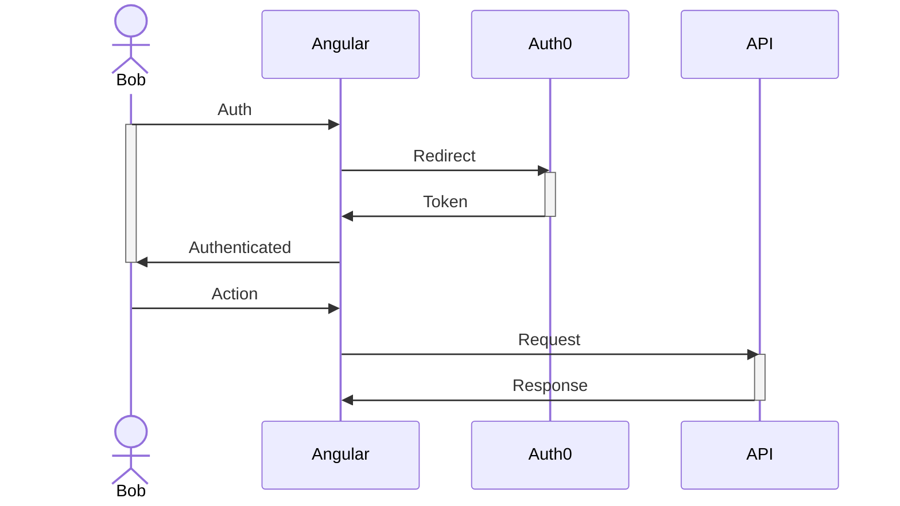

# Progetto

## :dart: Obiettivo

L'obiettivo del progetto è quello di realizzare un API 

## Progettazione

### :electric_plug: Architettura API 

Nel realizzare il progetto si è deciso di seguire come pattern architetturale quello delle **Layered Architecture**. In questa architettura gli strati che la costituiscono hanno ognuno un compito specifico e una responsabilità specifica, quelli che andremo ad implementare sono:

- **Router Layer**: descrizione dei vari layer
- **Service Layer**
- **Data Access Layer**

###  :whale: Architettura Docker 

L'infrastruttura `Docker` che si è implementata per realizzare il progetto, e che prevede l'utilizzo di `docker-compose` per la sua gestione, è la segunte:

## Diagram

Lo schema di interazione base dell'applicazione è il seguente:

- L'utente si autentica alla Single Page Application, la quale esegue un redirect verso il servizio di autenticazione (Auth0)
- Una volta che il processo di autenteicazione è andato a buon fine il servizio di autenticazione fornisce all'applicazione un Token
- Questo token verrò consumato per fare le richieste alle API

