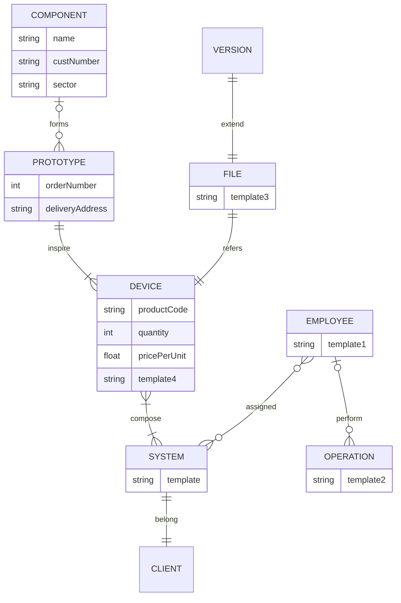

# Progetto

## :dart: Obiettivo

L'obiettivo del progetto è quello di realizzare un API che andrà ad agire sulle seguenti risorse:

- `components`: ovvero quelli che sono le varie componenti che vanno a comporre un sensore
- `devices`: la composizione di vari componenti insieme al software/file di configurazione specifici del dispositivo
- `systems`: il sistema ovvero l'insieme di dispositivi che verrà installato ad un cliente
- `users`: quelli che sono i client
- `operations`: quelli che sono gli interventi che verranno effettuati ad un determinato sistema

Inoltre per interagire con le API si è implementata una single page application realizzata tramite l'utilizzo del framework Angular.


## Progettazione

### :electric_plug: Pattern Architetturale API 

Nel realizzare il progetto si è deciso di seguire come pattern architetturale quello delle **Layered Architecture**. In questa architettura gli strati che la costituiscono hanno ognuno un compito specifico e una responsabilità specifica, quelli che andremo ad implementare sono:

- **Router Layer**: descrizione dei vari layer
- **Service Layer**
- **Data Access Layer**


###  :whale: Architettura Docker 

L'infrastruttura `Docker` che si è implementata per realizzare il progetto, e che prevede l'utilizzo di `docker-compose` per la sua gestione, è la segunte:


### Diagramma E-R

Come Database per il progetto abbiamo deciso di utilizzare MongoDB, un database NoSQL (Not Only SQL) open-source orientato ai documenti. È progettato per essere scalabile, flessibile e adatto a una vasta gamma di applicazioni. Segue una rappresentazione dello schema utilizzando la notazione del diagramma ER.
In MongoDB i dati vengono organizzati all'interno di "collezioni", quelle che siamo andati a realizzare sono le seguenti:

- `Clients`
- `Employees`
- ...



## Design Pattern

Breve descrizione dei design pattern utilizzati per la realizzazione del codice in TS. 

### Chain of Responsability

Abbiamo fatto ampio utilizzo di middleware, dato che il funzionamento di express.js si basa proprio su questa tipologia di pattern. In paritocolare abbiamo creato middleware con diverse funzionalità:

- funzionalità di **logging**: tramite l'utilizzo delle librerie winston e morgan andiamo a eeguire il logging di tutte quelle che sono le richiesta che l'API riceve, in questo modo otteniamo un elevata sicurezza su quello che accade e inoltre possiamo anche determinare le performance andando a vedere quelli che sono i tempi di risposta;
- funzionalità di **caching**: tramite l'utilizzo di redis, abbiamo realizzato dei middlware che, nelle principali rotte GET, vanno a verificare se la riposta a quella rotta è stato salvato in Redis. Questo al fine di evitare chiamati inutili all'API.
- funzionalità di **autenticazione**: dato che sono presenti diversi livelli di utenza i quali fanno uso delle funzionalità delle API tramite token, abbiamo realizzato dei middleware che vanno a verificare la validità dei token e dei permessi degli utenti sulle risorse che richiedono.
- funzionalità di **validazione**: per essere sicure dei dati ricevuti dalle richieste sono presenti dei middleware che prevedono la sanitization dei dati, in modo tale che solo l'informazione appropriata raggiunga l'applicazione; poi una fase di validazione per vedere che questi rispettino la business logic dell'applicazione.

### Singleton

Dato che l'API comunica con altri servizi abbastanza onerosi e in qui è presente conflitto delle risorse abbiamo deciso di utilizzare il pattern singleton per fare in modo che esista una sola istanza di questi oggetti. In particolare questo è stato realizzato per le connessione al DB e al servizio Redis; ma per esempio anche sul sistema di Logging in modo tale da non avere concorrenza nella scrittura sui file di log.

### Proxy

Si tratta di un design pattern strutturale utilizzato per fornire un surrogato o un rappresentante di un oggetto, controllando l'accesso a esso. Il suo obiettivo principale è quello di agire come intermediario tra il client e l'oggetto reale, consentendo di controllare, gestire o migliorare l'accesso all'oggetto senza modificarne la logica di base.
Nel nostro caso lo abbiamo utilizzato come intermediario per il client Redis che va poi ad interagire con la cache, questo in modo tale da poter applicare una logica personalizzata, ovvero estendere il comportamento di un oggetto senza modificarne l'implementazione.

### Builder

E' un design pattern creazionale utilizzato per separare la creazione di un oggetto complesso dalla sua rappresentazione. Questo pattern permette di costruire oggetti complessi passo dopo passo, consentendo una maggiore flessibilità e chiarezza nel processo di creazione. Per garantire un sistema di errori il più standard possibile abbiamo realizzato una classe di errori che costriusce l'oggetto di errore tramite questo pattern. In modo da garantire una descrizione esaustiva su quello che è l'errore che si è andato a verificare.


## Diagram

Lo schema di interazione base dell'applicazione è il seguente:

- L'utente si autentica alla Single Page Application, la quale esegue un redirect verso il servizio di autenticazione (Auth0)
- Una volta che il processo di autenteicazione è andato a buon fine il servizio di autenticazione fornisce all'applicazione un Token
- Questo token verrò consumato per fare le richieste alle API


### GET Routes

Ogni richiesta verso l'API ha poi specificata una catena di middleware che va ad agire su questa, in particolare abbiamo una catena di middleware per le richieste GET e una per le PUT e POST.
La catena di middleware che gestisce le richieste GET è la segguente:


Mostrare il funzionamento della catena di middleware per le principali richieste

```mermaid
```


## API Docs

### Clients

#### Get All

Routes:

```
GET /clients
```
Request:
```
Authorization: Bearer {token}
```

Response: 
```json
[
    {
    
    }
]
```
#### Get by ID
```
GET /clients/:id
```
Request:
```
Authorization: Bearer {token}
```

Response: 
```json
{
    
}
```

#### Update Clients
```
PUT /clients/:id
```
Request:
```json
Authorization: Bearer {token}
 {
    "firstName": "Peppino",
    "lastName": "Corleone",
    "birthDate": "1990-01-01T00:00:00.000Z",
    "fiscalCode": "ABCD1234E",
    "vatNumber": "12345678901",
    "address": "Montagana 123"
}
```
Response: 
```json
OK
```


## Startup

Per eseguire il progeto, dopo avere eseguito la `clone` del progetto, in locale procedere nel seguente modo:

1. Copiare il file di ambiente e apportare le modifiche, in particolare alle password
```
cp .env.template .env
```
2. Tramite Docker CLI eseguire il seguente comando:
```
docker-compose up -d --build
```

